# Решение задач блока Б

## Задача 1: Способы выплаты суммы монетами 1, 2 и 5 рублей

**Условие:** Дано натуральное число `N`. Получить все способы выплаты суммы с помощью монет достоинством 1, 2 и 5 рублей.

### Таблица внешних спецификаций (ТВС)

| Имя | Тип | Назначение                   |
|-----|-----|-----------------------------|
| N   | int | сумма для размена           |
| x   | int | количество монет по 1 рублю |
| y   | int | количество монет по 2 рубля |
| z   | int | количество монет по 5 рублей|

### Блок-схема

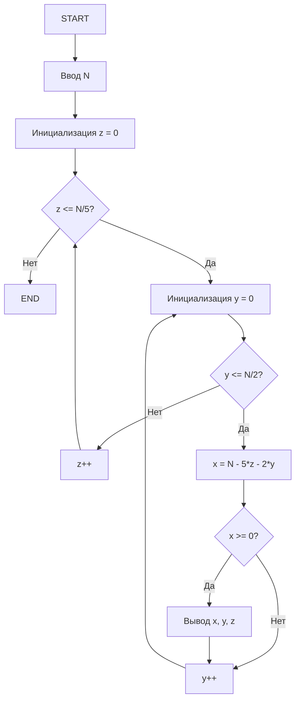

### Код

```cpp
#include <iostream>
using namespace std;

int main() {
    int N;
    cout << "Введите сумму N: ";
    cin >> N;
    
    for (int z = 0; z <= N / 5; z++) {
        for (int y = 0; y <= N / 2; y++) {
            int x = N - 5 * z - 2 * y;
            if (x >= 0) {
                cout << "1*" << x << " + 2*" << y << " + 5*" << z << endl;
            }
        }
    }
    
    return 0;
}
```

---

## Задача 2: Наименьший делитель числа

**Условие:** Дано натуральное число `Z`. Найти его наименьший делитель (кроме 1).

### ТВС

| Имя | Тип | Назначение         |
|-----|-----|-------------------|
| Z   | int | входное число     |
| d   | int | найденный делитель|

### Блок-схема

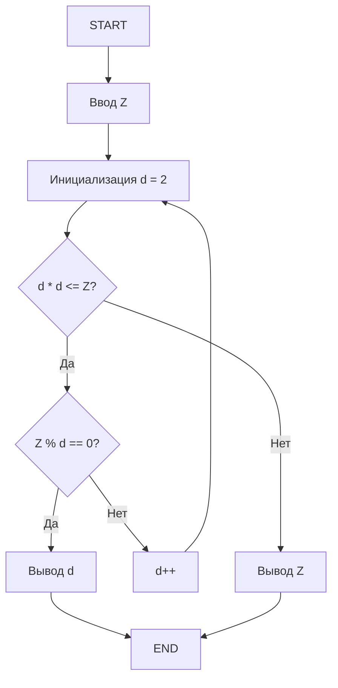

### Код

```cpp
#include <iostream>
using namespace std;

int main() {
    int Z;
    cout << "Введите число Z: ";
    cin >> Z;
    
    for (int d = 2; d * d <= Z; d++) {
        if (Z % d == 0) {
            cout << "Наименьший делитель: " << d;
            return 0;
        }
    }
    
    cout << "Наименьший делитель: " << Z;
    return 0;
}
```

---

## Задача 3: Скорость туристов

**Условие:** Туристы проехали N и M км в два дня, скорость одинаковая и выражалась целым числом км/ч. Найти наибольшую возможную скорость.

### ТВС

| Имя | Тип | Назначение                     |
|-----|-----|-------------------------------|
| N   | int | путь 1-го дня                 |
| M   | int | путь 2-го дня                 |
| v   | int | наибольшая скорость (НОД(N,M))|

### Блок-схема

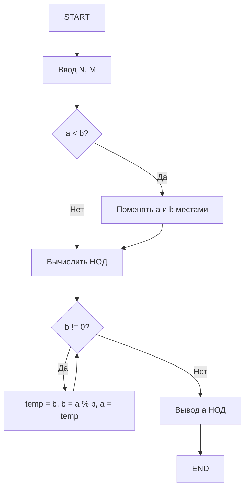

### Код

```cpp
#include <iostream>
using namespace std;

int gcd(int a, int b) {
    while (b != 0) {
        int temp = b;
        b = a % b;
        a = temp;
    }
    return a;
}

int main() {
    int N, M;
    cout << "Введите расстояния N и M: ";
    cin >> N >> M;
    
    cout << "Наибольшая возможная скорость: " << gcd(N, M);
    return 0;
}
```

---

## Задача 4: Помощники деда (Репка)

**Условие:** Надо развить усилие N кг. Дед тянет с силой D. Каждый i-й помощник тянет с усилием `S/(i/(i+1))`, где S – общее усилие предыдущих.

### ТВС

| Имя | Тип   | Назначение       |
|-----|-------|-----------------|
| N   | int   | требуемое усилие|
| D   | int   | усилие деда     |
| i   | int   | номер помощника |
| S   | float | общее усилие    |

### Блок-схема

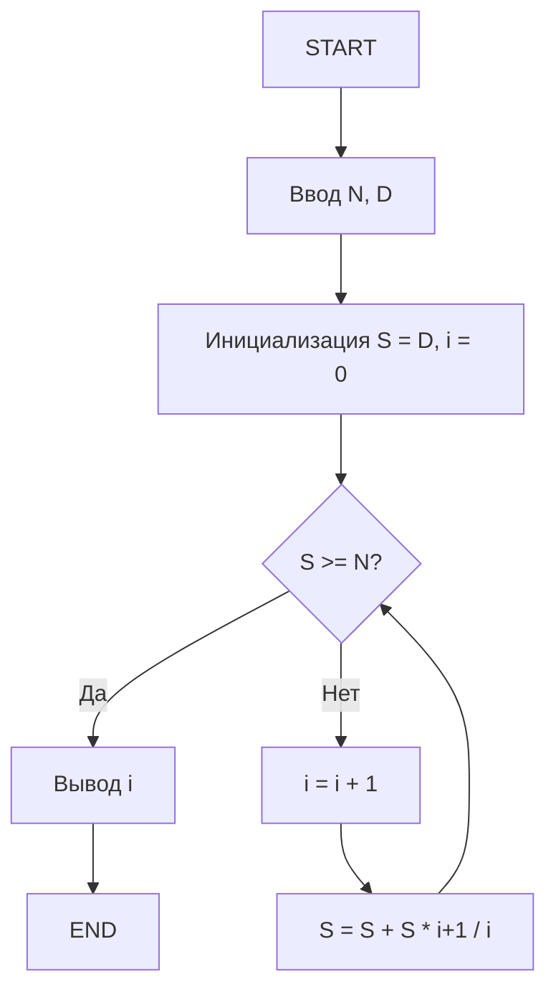

### Код

```cpp
#include <iostream>
using namespace std;

int main() {
    int N, D;
    cout << "Введите требуемое усилие N и усилие деда D: ";
    cin >> N >> D;
    
    double S = D;
    int i = 0;
    
    while (S < N) {
        i++;
        S += S * (i + 1.0) / i;
    }
    
    cout << "Количество помощников: " << i;
    return 0;
}
```

---

## Задача 5: Совершенное число

**Условие:** Проверить, является ли число совершенным.

### ТВС

| Имя | Тип | Назначение        |
|-----|-----|------------------|
| n   | int | проверяемое число|
| sum | int | сумма делителей  |

### Блок-схема

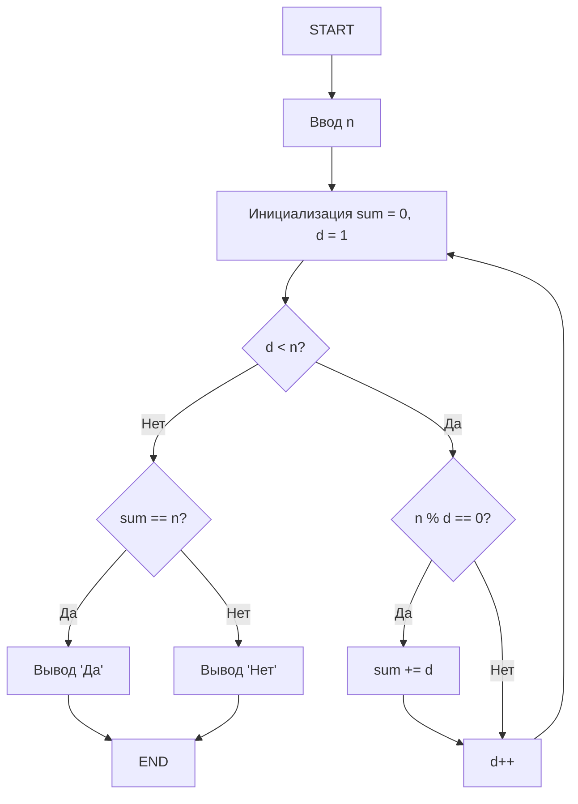

### Код

```cpp
#include <iostream>
using namespace std;

int main() {
    int n;
    cout << "Введите число: ";
    cin >> n;
    
    int sum = 0;
    for (int d = 1; d < n; d++) {
        if (n % d == 0) {
            sum += d;
        }
    }
    
    if (sum == n) {
        cout << "Да";
    } else {
        cout << "Нет";
    }
    
    return 0;
}
```

---

## Задача 6: Представление числа как суммы трёх квадратов

**Условие:** Найти все тройки x,y,z такие, что `N = x^2 + y^2 + z^2`.

### ТВС

| Имя | Тип | Назначение          |
|-----|-----|--------------------|
| N   | int | заданное число     |
| x   | int | первое слагаемое   |
| y   | int | второе слагаемое   |
| z   | int | третье слагаемое   |

### Блок-схема

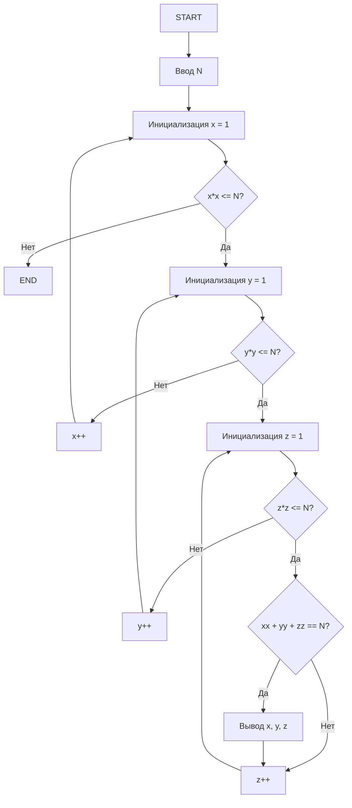

### Код

```cpp
#include <iostream>
using namespace std;

int main() {
    int N;
    cout << "Введите число N: ";
    cin >> N;
    
    for (int x = 1; x * x <= N; x++) {
        for (int y = 1; y * y <= N; y++) {
            for (int z = 1; z * z <= N; z++) {
                if (x * x + y * y + z * z == N) {
                    cout << x << "^2 + " << y << "^2 + " << z << "^2 = " << N << endl;
                }
            }
        }
    }
    
    return 0;
}
```

---

## Задача 7: Яйца крестьянки

**Условие:** При раскладке по 2,3,... остаток 1, а по N — без остатка. Найти минимальное число яиц.

### ТВС

| Имя  | Тип | Назначение                    |
|------|-----|------------------------------|
| N    | int | число для деления без остатка|
| eggs | int | количество яиц               |
| k    | int | делитель                     |

### Блок-схема

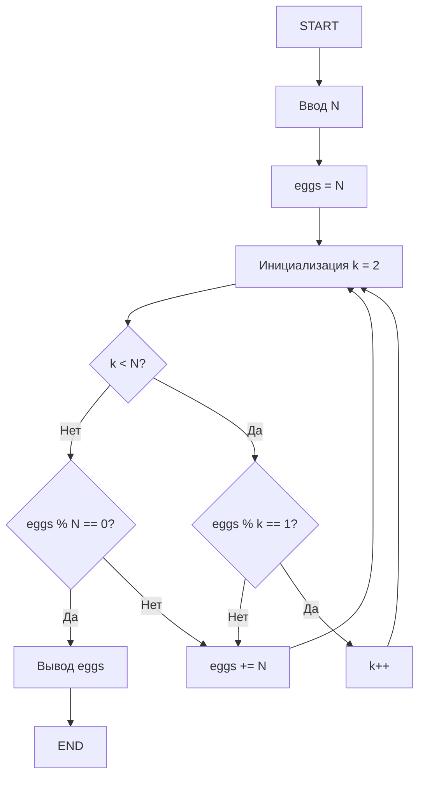

### Код

```cpp
#include <iostream>
using namespace std;

bool check(int eggs, int N) {
    for (int k = 2; k < N; k++) {
        if (eggs % k != 1) {
            return false;
        }
    }
    return eggs % N == 0;
}

int main() {
    int N;
    cout << "Введите N: ";
    cin >> N;
    
    int eggs = N;
    while (!check(eggs, N)) {
        eggs += N;
    }
    
    cout << "Минимальное количество яиц: " << eggs;
    return 0;
}
```

---

## Задача 8: Простые числа в интервале

**Условие:** Найти все простые числа в интервале от M до N.

### ТВС

| Имя | Тип | Назначение          |
|-----|-----|--------------------|
| M   | int | начало интервала   |
| N   | int | конец интервала    |
| num | int | текущее число      |
| d   | int | делитель           |
| flag| bool| флаг простоты числа|

### Блок-схема

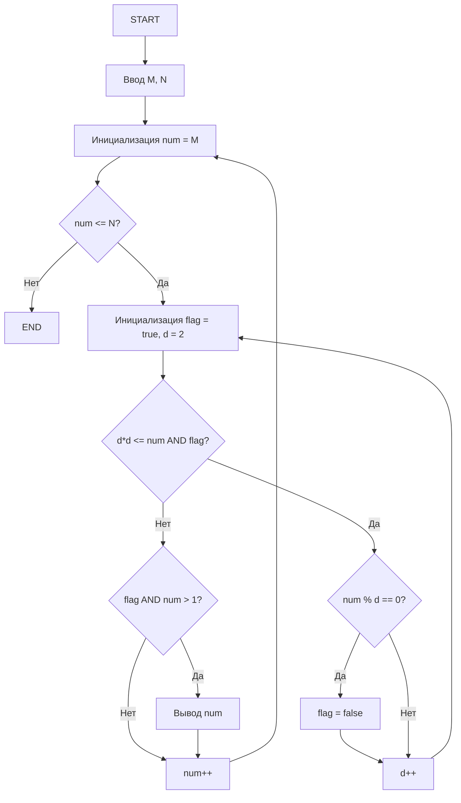


### Код

```cpp
#include <iostream>
using namespace std;

bool isPrime(int num) {
    if (num <= 1) return false;
    for (int d = 2; d * d <= num; d++) {
        if (num % d == 0) {
            return false;
        }
    }
    return true;
}

int main() {
    int M, N;
    cout << "Введите интервал [M, N]: ";
    cin >> M >> N;
    
    for (int num = M; num <= N; num++) {
        if (isPrime(num)) {
            cout << num << " ";
        }
    }
    
    return 0;
}
```


# Задача А: Вариант 1 — Вычисление $\sinh(x)$

## 1. Условие задачи
Вычислить $\sinh(x)$ для $|x| < \infty$ тремя способами:
1. Сумма ряда с точностью $\epsilon$
2. Сумма первых $k$ членов
3. Аналитически с помощью $\sinh(x)$ из <cmath>

**Ряд:**
$$\sinh(x) = \sum_{n=0}^{\infty} \frac{x^{2n+1}}{(2n+1)!} = x + \frac{x^3}{3!} + \frac{x^5}{5!} + \dots$$

**Применение:** Физика (цепные линии), инженерия (электрические цепи), ML (функции активации).

## 2. Математическая модель
- **С $\epsilon$:** $y = \sum u_n$, $u_0 = x$, $u_{n+1} = u_n \cdot \frac{x^2}{(2n+2)(2n+3)}$, пока $|u_n| > \epsilon$
- **Первые $k$:** $y = \sum_{n=0}^{k-1} u_n$, аналогичный расчёт $u_n$
- **Аналитически:** $y = \sinh(x)$

## 3. Таблица внешних спецификаций

| Параметр | Тип     | Диапазон           | Описание              |
|----------|---------|--------------------|-----------------------|
| x        | double  | $-\infty < x < \infty$ | Аргумент функции    |
| eps      | double  | $0 < \epsilon < 1$ | Точность             |
| k        | int     | $k \geq 1$         | Количество членов ряда |
| mode     | int     | 1, 2, 3            | Режим вычисления     |
| y        | double  | Любое вещественное | Значение $\sinh(x)$  |

## 4. Алгоритмизация

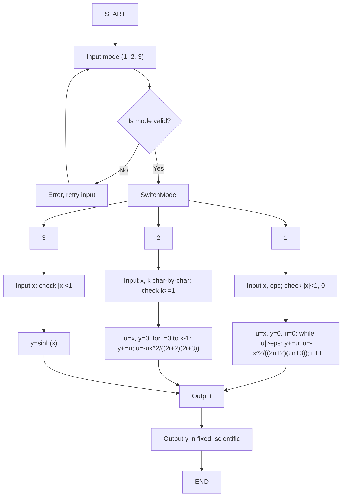
## 5. Проектирование тестов

| № | Назначение | Входные данные | Ожидаемый результат | Пояснение |
|---|------------|----------------|---------------------|-----------|
| 1 | Режим 1, базовый | mode=1, x=1, eps=0.001 | y≈1.175201 | Сумма ряда до $\epsilon$ |
| 2 | Режим 2, первые k | mode=2, x=1, k=3 | y≈1.166667 | Первые 3 члена |
| 3 | Режим 3, аналитически | mode=3, x=1 | y≈1.175201 | $\sinh(1)$ из <cmath> |
| 4 | Некорректный eps | mode=1, x=1, eps=2 | Ошибка | Проверка $0 < \epsilon < 1$ |
| 5 | Некорректный k | mode=2, x=1, k=-1 | Ошибка | Проверка $k \geq 1$ |
| 6 | Некорректный mode | mode=4 | Ошибка | Проверка mode (1-3) |

## 6. Проверка правильности алгоритма

**Тест 1:** $x=1$, $\epsilon=0.001$
- $u=x=1$, $y=0$, $n=0$
- $|u|=1 > 0.001$, $y=1$, $u=1 \cdot \frac{1^2}{2 \cdot 3} \approx 0.166667$, $n=1$
- $|u|=0.166667 > 0.001$, $y=1.166667$, $u \approx 0.008333$, $n=2$
- $|u|=0.008333 > 0.001$, $y \approx 1.175$, $u \approx 0.000198 < 0.001$, стоп
- Результат: $y \approx 1.175201$

**Тест 2:** $k=3$, $y=1 + 0.166667 + 0.008333 \approx 1.166667$

**Тест 3:** $y=\sinh(1) \approx 1.175201$

## 7. Кодирование алгоритма

```cpp
#include <iostream>
#include <sstream>
#include <cmath>
#include <iomanip>
using namespace std;

int main() {
    setlocale(LC_ALL, "Russian");
    int mode;
    double x, eps, y;
    int k;
    string input;

    // Ввод mode
    while (true) {
        cout << "Введите режим (1 - точность, 2 - k членов, 3 - аналитически): ";
        getline(cin, input);
        stringstream ss(input);
        if (ss >> mode && ss.eof() && mode >= 1 && mode <= 3) break;
        cout << "Ошибка: mode должен быть 1, 2 или 3" << endl;
    }

    switch (mode) {
        case 1: // Сумма с точностью
            while (true) {
                cout << "Введите x: ";
                getline(cin, input);
                stringstream ss(input);
                if (ss >> x && ss.eof()) break;
                cout << "Ошибка: x должен быть числом" << endl;
            }
            while (true) {
                cout << "Введите eps (0 < eps < 1): ";
                getline(cin, input);
                stringstream ss(input);
                if (ss >> eps && ss.eof() && eps > 0 && eps < 1) break;
                cout << "Ошибка: eps должен быть 0 < eps < 1" << endl;
            }
            {
                double u = x;
                y = 0.0;
                int n = 0;
                while (fabs(u) > eps) {
                    y += u;
                    n++;
                    u = u * x * x / ((2 * n) * (2 * n + 1));
                }
            }
            cout << fixed << setprecision(6) << "Результат (fixed): " << y << endl;
            cout << scientific << setprecision(6) << "Результат (scientific): " << y << endl;
            break;

        case 2: // Первые k членов
            while (true) {
                cout << "Введите x: ";
                getline(cin, input);
                stringstream ss(input);
                if (ss >> x && ss.eof()) break;
                cout << "Ошибка: x должен быть числом" << endl;
            }
            while (true) {
                cout << "Введите k (>= 1): ";
                k = 0;
                char c;
                bool valid = true;
                while (cin.get(c) && c != '\n') {
                    if (c >= '0' && c <= '9') k = k * 10 + (c - '0');
                    else valid = false;
                }
                if (valid && k >= 1) break;
                cout << "Ошибка: k должен быть целым числом >= 1" << endl;
                cin.clear();
                cin.ignore(10000, '\n');
            }
            {
                double u = x;
                y = 0.0;
                for (int i = 0; i < k; i++) {
                    y += u;
                    u = u * x * x / ((2 * i + 2) * (2 * i + 3));
                }
            }
            cout << fixed << setprecision(6) << "Результат (fixed): " << y << endl;
            cout << scientific << setprecision(6) << "Результат (scientific): " << y << endl;
            break;

        case 3: // Аналитически
            while (true) {
                cout << "Введите x: ";
                getline(cin, input);
                stringstream ss(input);
                if (ss >> x && ss.eof()) break;
                cout << "Ошибка: x должен быть числом" << endl;
            }
            y = sinh(x);
            cout << fixed << setprecision(6) << "Результат (fixed): " << y << endl;
            cout << scientific << setprecision(6) << "Результат (scientific): " << y << endl;
            break;
    }
    return 0;
}
```

# Задача А: Вариант 2 — Вычисление $\cosh(x)$

## 1. Условие задачи
Вычислить $\cosh(x)$ для $|x| < \infty$:
$$\cosh(x) = \sum_{n=0}^{\infty} \frac{x^{2n}}{(2n)!} = 1 + \frac{x^2}{2!} + \frac{x^4}{4!} + \dots$$

**Применение:** Физика (траектории), криптография (хеширование).

## 2. Математическая модель
- **С $\epsilon$:** $y = \sum u_n$, $u_0 = 1$, $u_{n+1} = u_n \cdot \frac{x^2}{(2n+1)(2n+2)}$
- **Первые $k$:** аналогично, цикл for
- **Аналитически:** $y = \cosh(x)$

## 3. Таблица внешних спецификаций

| Параметр | Тип     | Диапазон           | Описание              |
|----------|---------|--------------------|-----------------------|
| x        | double  | $-\infty < x < \infty$ | Аргумент функции    |
| eps      | double  | $0 < \epsilon < 1$ | Точность             |
| k        | int     | $k \geq 1$         | Количество членов ряда |
| mode     | int     | 1, 2, 3            | Режим вычисления     |
| y        | double  | $y \geq 1$         | Значение $\cosh(x)$  |

## 4. Алгоритмизация

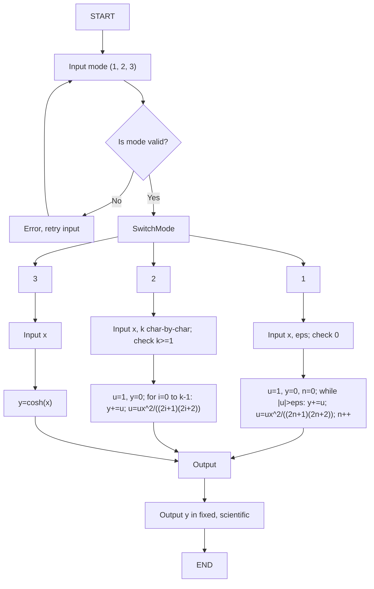

## 5. Проектирование тестов

| № | Назначение | Входные данные | Ожидаемый результат | Пояснение |
|---|------------|----------------|---------------------|-----------|
| 1 | Режим 1, базовый | mode=1, x=1, eps=0.001 | y≈1.543081 | Сумма ряда до $\epsilon$ |
| 2 | Режим 2, первые k | mode=2, x=1, k=3 | y≈1.541667 | Первые 3 члена |
| 3 | Режим 3, аналитически | mode=3, x=1 | y≈1.543081 | $\cosh(1)$ из <cmath> |
| 4 | Некорректный eps | mode=1, x=1, eps=2 | Ошибка | Проверка $0 < \epsilon < 1$ |
| 5 | Некорректный k | mode=2, x=1, k=-1 | Ошибка | Проверка $k \geq 1$ |

## 6. Проверка правильности алгоритма

**Тест 1:** $u=1$, $y=0$, $u=0.5$, $y=1.5$, $u \approx 0.041667$, $y \approx 1.541667$, ... до $|u| \leq 0.001$

**Тест 2:** $y=1 + 0.5 + 0.041667 \approx 1.541667$

**Тест 3:** $y=\cosh(1) \approx 1.543081$

## 7. Кодирование алгоритма

```cpp
#include <iostream>
#include <sstream>
#include <cmath>
#include <iomanip>
using namespace std;

int main() {
    setlocale(LC_ALL, "Russian");
    int mode;
    double x, eps, y;
    int k;
    string input;

    while (true) {
        cout << "Введите режим (1 - точность, 2 - k членов, 3 - аналитически): ";
        getline(cin, input);
        stringstream ss(input);
        if (ss >> mode && ss.eof() && mode >= 1 && mode <= 3) break;
        cout << "Ошибка: mode должен быть 1, 2 или 3" << endl;
    }

    switch (mode) {
        case 1:
            while (true) {
                cout << "Введите x: ";
                getline(cin, input);
                stringstream ss(input);
                if (ss >> x && ss.eof()) break;
                cout << "Ошибка: x должен быть числом" << endl;
            }
            while (true) {
                cout << "Введите eps (0 < eps < 1): ";
                getline(cin, input);
                stringstream ss(input);
                if (ss >> eps && ss.eof() && eps > 0 && eps < 1) break;
                cout << "Ошибка: eps должен быть 0 < eps < 1" << endl;
            }
            {
                double u = 1.0;
                y = 0.0;
                int n = 0;
                while (fabs(u) > eps) {
                    y += u;
                    n++;
                    u = u * x * x / ((2 * n - 1) * (2 * n));
                }
            }
            cout << fixed << setprecision(6) << "Результат (fixed): " << y << endl;
            cout << scientific << setprecision(6) << "Результат (scientific): " << y << endl;
            break;

        case 2:
            while (true) {
                cout << "Введите x: ";
                getline(cin, input);
                stringstream ss(input);
                if (ss >> x && ss.eof()) break;
                cout << "Ошибка: x должен быть числом" << endl;
            }
            while (true) {
                cout << "Введите k (>= 1): ";
                k = 0;
                char c;
                bool valid = true;
                while (cin.get(c) && c != '\n') {
                    if (c >= '0' && c <= '9') k = k * 10 + (c - '0');
                    else valid = false;
                }
                if (valid && k >= 1) break;
                cout << "Ошибка: k должен быть целым числом >= 1" << endl;
                cin.clear();
                cin.ignore(10000, '\n');
            }
            {
                double u = 1.0;
                y = 0.0;
                for (int i = 0; i < k; i++) {
                    y += u;
                    u = u * x * x / ((2 * i + 1) * (2 * i + 2));
                }
            }
            cout << fixed << setprecision(6) << "Результат (fixed): " << y << endl;
            cout << scientific << setprecision(6) << "Результат (scientific): " << y << endl;
            break;

        case 3:
            while (true) {
                cout << "Введите x: ";
                getline(cin, input);
                stringstream ss(input);
                if (ss >> x && ss.eof()) break;
                cout << "Ошибка: x должен быть числом" << endl;
            }
            y = cosh(x);
            cout << fixed << setprecision(6) << "Результат (fixed): " << y << endl;
            cout << scientific << setprecision(6) << "Результат (scientific): " << y << endl;
            break;
    }
    return 0;
}


# Задача А: Вариант 3 — Вычисление $\sin(x)$

## 1. Условие задачи
Вычислить $\sin(x)$ для $|x| < \infty$:
$$\sin(x) = \sum_{n=0}^{\infty} (-1)^n \frac{x^{2n+1}}{(2n+1)!} = x - \frac{x^3}{3!} + \frac{x^5}{5!} - \dots$$

**Применение:** Физика (колебания), графика (повороты).

## 2. Математическая модель
- **С $\epsilon$:** $u_0 = x$, $u_{n+1} = -u_n \cdot \frac{x^2}{(2n+2)(2n+3)}$
- **Первые $k$:** аналогично, цикл for
- **Аналитически:** $y = \sin(x)$

## 3. Таблица внешних спецификаций

| Параметр | Тип     | Диапазон           | Описание              |
|----------|---------|--------------------|-----------------------|
| x        | double  | $-\infty < x < \infty$ | Аргумент функции    |
| eps      | double  | $0 < \epsilon < 1$ | Точность             |
| k        | int     | $k \geq 1$         | Количество членов ряда |
| mode     | int     | 1, 2, 3            | Режим вычисления     |
| y        | double  | $-1 \leq y \leq 1$ | Значение $\sin(x)$   |

## 4. Алгоритмизация

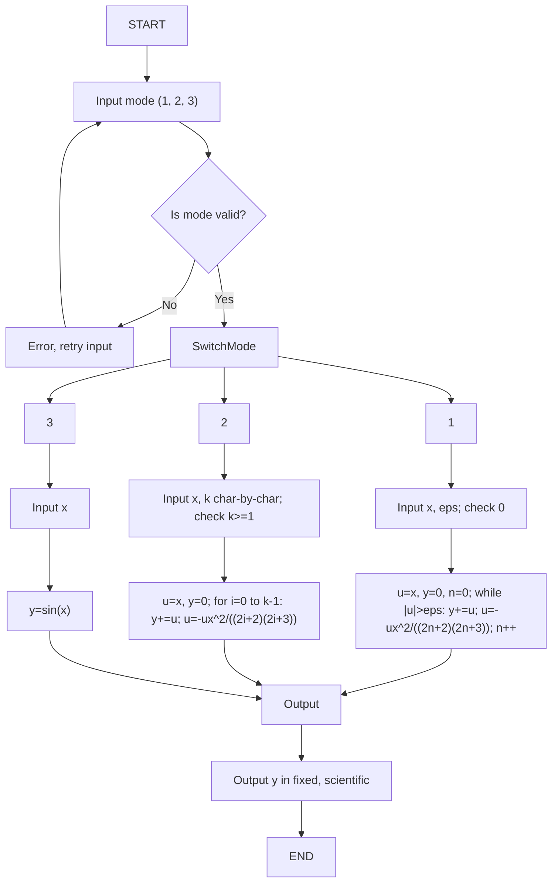

## 5. Проектирование тестов

| № | Назначение | Входные данные | Ожидаемый результат | Пояснение |
|---|------------|----------------|---------------------|-----------|
| 1 | Режим 1, базовый | mode=1, x=1, eps=0.001 | y≈0.841471 | Сумма ряда до $\epsilon$ |
| 2 | Режим 2, первые k | mode=2, x=1, k=3 | y≈0.841468 | Первые 3 члена |
| 3 | Режим 3, аналитически | mode=3, x=1 | y≈0.841471 | $\sin(1)$ из <cmath> |
| 4 | Некорректный eps | mode=1, x=1, eps=2 | Ошибка | Проверка $0 < \epsilon < 1$ |
| 5 | Некорректный k | mode=2, x=1, k=-1 | Ошибка | Проверка $k \geq 1$ |

## 6. Проверка правильности алгоритма

**Тест 1:** $u=1$, $y=1$, $u \approx -0.166667$, $y \approx 0.833333$, $u \approx 0.008333$, ... до $|u| \leq 0.001$

**Тест 2:** $y=1 - 0.166667 + 0.008333 \approx 0.841468$

**Тест 3:** $y=\sin(1) \approx 0.841471$

## 7. Кодирование алгоритма

```cpp
#include <iostream>
#include <sstream>
#include <cmath>
#include <iomanip>
using namespace std;

int main() {
    setlocale(LC_ALL, "Russian");
    int mode;
    double x, eps, y;
    int k;
    string input;

    while (true) {
        cout << "Введите режим (1 - точность, 2 - k членов, 3 - аналитически): ";
        getline(cin, input);
        stringstream ss(input);
        if (ss >> mode && ss.eof() && mode >= 1 && mode <= 3) break;
        cout << "Ошибка: mode должен быть 1, 2 или 3" << endl;
    }

    switch (mode) {
        case 1:
            while (true) {
                cout << "Введите x: ";
                getline(cin, input);
                stringstream ss(input);
                if (ss >> x && ss.eof()) break;
                cout << "Ошибка: x должен быть числом" << endl;
            }
            while (true) {
                cout << "Введите eps (0 < eps < 1): ";
                getline(cin, input);
                stringstream ss(input);
                if (ss >> eps && ss.eof() && eps > 0 && eps < 1) break;
                cout << "Ошибка: eps должен быть 0 < eps < 1" << endl;
            }
            {
                double u = x;
                y = 0.0;
                int n = 0;
                while (fabs(u) > eps) {
                    y += u;
                    n++;
                    u = -u * x * x / ((2 * n) * (2 * n + 1));
                }
            }
            cout << fixed << setprecision(6) << "Результат (fixed): " << y << endl;
            cout << scientific << setprecision(6) << "Результат (scientific): " << y << endl;
            break;

        case 2:
            while (true) {
                cout << "Введите x: ";
                getline(cin, input);
                stringstream ss(input);
                if (ss >> x && ss.eof()) break;
                cout << "Ошибка: x должен быть числом" << endl;
            }
            while (true) {
                cout << "Введите k (>= 1): ";
                k = 0;
                char c;
                bool valid = true;
                while (cin.get(c) && c != '\n') {
                    if (c >= '0' && c <= '9') k = k * 10 + (c - '0');
                    else valid = false;
                }
                if (valid && k >= 1) break;
                cout << "Ошибка: k должен быть целым числом >= 1" << endl;
                cin.clear();
                cin.ignore(10000, '\n');
            }
            {
                double u = x;
                y = 0.0;
                for (int i = 0; i < k; i++) {
                    y += u;
                    u = -u * x * x / ((2 * i + 2) * (2 * i + 3));
                }
            }
            cout << fixed << setprecision(6) << "Результат (fixed): " << y << endl;
            cout << scientific << setprecision(6) << "Результат (scientific): " << y << endl;
            break;

        case 3:
            while (true) {
                cout << "Введите x: ";
                getline(cin, input);
                stringstream ss(input);
                if (ss >> x && ss.eof()) break;
                cout << "Ошибка: x должен быть числом" << endl;
            }
            y = sin(x);
            cout << fixed << setprecision(6) << "Результат (fixed): " << y << endl;
            cout << scientific << setprecision(6) << "Результат (scientific): " << y << endl;
            break;
    }
    return 0;
}
```

# Задача А: Вариант 4 — Вычисление $\sin(x + a)$

## 1. Условие задачи
Вычислить $\sin(x + a)$ для $|x| < \infty$:
$$\sin(x + a) = \sum_{n=0}^{\infty} \frac{\sin(a + \frac{n\pi}{2}) x^n}{n!} = \sin a + (\cos a) x - \frac{\sin a}{2!} x^2 - \frac{\cos a}{3!} x^3 + \dots$$

**Применение:** Сигналы с фазовым сдвигом, астрономия.

## 2. Математическая модель
- **С $\epsilon$:** $u_0 = \sin a$, $u_{n+1} = u_n \cdot \frac{x}{n+1} \cdot \frac{\sin(a + \frac{(n+1)\pi}{2})}{\sin(a + \frac{n\pi}{2})}$
- **Первые $k$:** аналогично, цикл for
- **Аналитически:** $y = \sin(x + a)$

## 3. Таблица внешних спецификаций

| Параметр | Тип     | Диапазон           | Описание              |
|----------|---------|--------------------|-----------------------|
| x, a     | double  | $-\infty < x, a < \infty$ | Аргументы функции |
| eps      | double  | $0 < \epsilon < 1$ | Точность             |
| k        | int     | $k \geq 1$         | Количество членов ряда |
| mode     | int     | 1, 2, 3            | Режим вычисления     |
| y        | double  | $-1 \leq y \leq 1$ | Значение $\sin(x + a)$ |

## 4. Алгоритмизация

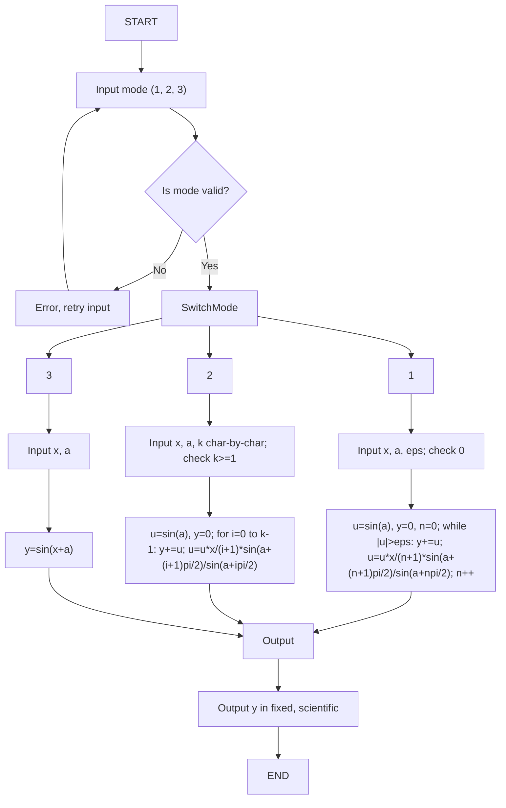

## 5. Проектирование тестов

| № | Назначение | Входные данные | Ожидаемый результат | Пояснение |
|---|------------|----------------|---------------------|-----------|
| 1 | Режим 1, базовый | mode=1, x=1, a=0, eps=0.001 | y≈0.841471 | Сумма ряда до $\epsilon$ |
| 2 | Режим 2, первые k | mode=2, x=1, a=0, k=3 | y≈0.841468 | Первые 3 члена |
| 3 | Режим 3, аналитически | mode=3, x=1, a=0 | y≈0.841471 | $\sin(1)$ из <cmath> |
| 4 | Некорректный eps | mode=1, x=1, a=0, eps=2 | Ошибка | Проверка $0 < \epsilon < 1$ |
| 5 | Некорректный k | mode=2, x=1, a=0, k=-1 | Ошибка | Проверка $k \geq 1$ |

## 6. Проверка правильности алгоритма

**Тест 1:** $a=0$, $u=\sin(0)=0$, next $u=\cos(0) \cdot 1=1$, $y=1$, $u \approx -0.166667$, ... до $|u| \leq 0.001$

**Тест 2:** $y=0 + 1 - 0.166667 + 0.008333 \approx 0.841468$

**Тест 3:** $y=\sin(1+0) \approx 0.841471$

## 7. Кодирование алгоритма

```cpp
#include <iostream>
#include <sstream>
#include <cmath>
#include <iomanip>
using namespace std;

int main() {
    setlocale(LC_ALL, "Russian");
    int mode;
    double x, a, eps, y;
    int k;
    string input;

    while (true) {
        cout << "Введите режим (1 - точность, 2 - k членов, 3 - аналитически): ";
        getline(cin, input);
        stringstream ss(input);
        if (ss >> mode && ss.eof() && mode >= 1 && mode <= 3) break;
        cout << "Ошибка: mode должен быть 1, 2 или 3" << endl;
    }

    switch (mode) {
        case 1:
            while (true) {
                cout << "Введите x: ";
                getline(cin, input);
                stringstream ss(input);
                if (ss >> x && ss.eof()) break;
                cout << "Ошибка: x должен быть числом" << endl;
            }
            while (true) {
                cout << "Введите a: ";
                getline(cin, input);
                stringstream ss(input);
                if (ss >> a && ss.eof()) break;
                cout << "Ошибка: a должен быть числом" << endl;
            }
            while (true) {
                cout << "Введите eps (0 < eps < 1): ";
                getline(cin, input);
                stringstream ss(input);
                if (ss >> eps && ss.eof() && eps > 0 && eps < 1) break;
                cout << "Ошибка: eps должен быть 0 < eps < 1" << endl;
            }
            {
                double u = sin(a);
                y = 0.0;
                int n = 0;
                while (fabs(u) > eps) {
                    y += u;
                    n++;
                    u = u * x / n * sin(a + n * M_PI / 2) / sin(a + (n-1) * M_PI / 2);
                }
            }
            cout << fixed << setprecision(6) << "Результат (fixed): " << y << endl;
            cout << scientific << setprecision(6) << "Результат (scientific): " << y << endl;
            break;

        case 2:
            while (true) {
                cout << "Введите x: ";
                getline(cin, input);
                stringstream ss(input);
                if (ss >> x && ss.eof()) break;
                cout << "Ошибка: x должен быть числом" << endl;
            }
            while (true) {
                cout << "Введите a: ";
                getline(cin, input);
                stringstream ss(input);
                if (ss >> a && ss.eof()) break;
                cout << "Ошибка: a должен быть числом" << endl;
            }
            while (true) {
                cout << "Введите k (>= 1): ";
                k = 0;
                char c;
                bool valid = true;
                while (cin.get(c) && c != '\n') {
                    if (c >= '0' && c <= '9') k = k * 10 + (c - '0');
                    else valid = false;
                }
                if (valid && k >= 1) break;
                cout << "Ошибка: k должен быть целым числом >= 1" << endl;
                cin.clear();
                cin.ignore(10000, '\n');
            }
            {
                double u = sin(a);
                y = 0.0;
                for (int i = 0; i < k; i++) {
                    y += u;
                    u = u * x / (i + 1) * sin(a + (i + 1) * M_PI / 2) / sin(a + i * M_PI / 2);
                }
            }
            cout << fixed << setprecision(6) << "Результат (fixed): " << y << endl;
            cout << scientific << setprecision(6) << "Результат (scientific): " << y << endl;
            break;

        case 3:
            while (true) {
                cout << "Введите x: ";
                getline(cin, input);
                stringstream ss(input);
                if (ss >> x && ss.eof()) break;
                cout << "Ошибка: x должен быть числом" << endl;
            }
            while (true) {
                cout << "Введите a: ";
                getline(cin, input);
                stringstream ss(input);
                if (ss >> a && ss.eof()) break;
                cout << "Ошибка: a должен быть числом" << endl;
            }
            y = sin(x + a);
            cout << fixed << setprecision(6) << "Результат (fixed): " << y << endl;
            cout << scientific << setprecision(6) << "Результат (scientific): " << y << endl;
            break;
    }
    return 0;
}
```

# Задача А: Вариант 5 — Вычисление $\cos(x)$

## 1. Условие задачи
Вычислить $\cos(x)$ для $|x| < \infty$:
$$\cos(x) = \sum_{n=0}^{\infty} (-1)^n \frac{x^{2n}}{(2n)!} = 1 - \frac{x^2}{2!} + \frac{x^4}{4!} - \dots$$

**Применение:** Обработка сигналов, графика.

## 2. Математическая модель
- **С $\epsilon$:** $u_0 = 1$, $u_{n+1} = -u_n \cdot \frac{x^2}{(2n+1)(2n+2)}$
- **Первые $k$:** аналогично
- **Аналитически:** $y = \cos(x)$

## 3. Таблица внешних спецификаций

| Параметр | Тип     | Диапазон           | Описание              |
|----------|---------|--------------------|-----------------------|
| x        | double  | $-\infty < x < \infty$ | Аргумент функции    |
| eps      | double  | $0 < \epsilon < 1$ | Точность             |
| k        | int     | $k \geq 1$         | Количество членов ряда |
| mode     | int     | 1, 2, 3            | Режим вычисления     |
| y        | double  | $-1 \leq y \leq 1$ | Значение $\cos(x)$   |

## 4. Алгоритмизация

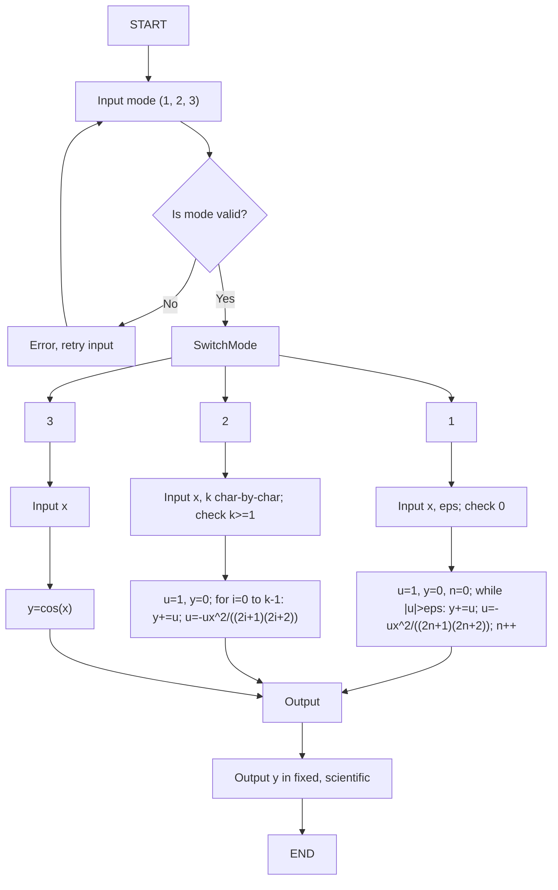

## 5. Проектирование тестов

| № | Назначение | Входные данные | Ожидаемый результат | Пояснение |
|---|------------|----------------|---------------------|-----------|
| 1 | Режим 1, базовый | mode=1, x=1, eps=0.001 | y≈0.540302 | Сумма ряда до $\epsilon$ |
| 2 | Режим 2, первые k | mode=2, x=1, k=3 | y≈0.541667 | Первые 3 члена |
| 3 | Режим 3, аналитически | mode=3, x=1 | y≈0.540302 | $\cos(1)$ из <cmath> |
| 4 | Некорректный eps | mode=1, x=1, eps=2 | Ошибка | Проверка $0 < \epsilon < 1$ |
| 5 | Некорректный k | mode=2, x=1, k=-1 | Ошибка | Проверка $k \geq 1$ |

## 6. Проверка правильности алгоритма

**Тест 1:** $u=1$, $y=1$, $u=-0.5$, $y=0.5$, $u \approx 0.041667$, ... до $|u| \leq 0.001$

**Тест 2:** $y=1 - 0.5 + 0.041667 \approx 0.541667$

**Тест 3:** $y=\cos(1) \approx 0.540302$

## 7. Кодирование алгоритма

```cpp
#include <iostream>
#include <sstream>
#include <cmath>
#include <iomanip>
using namespace std;

int main() {
    setlocale(LC_ALL, "Russian");
    int mode;
    double x, eps, y;
    int k;
    string input;

    while (true) {
        cout << "Введите режим (1 - точность, 2 - k членов, 3 - аналитически): ";
        getline(cin, input);
        stringstream ss(input);
        if (ss >> mode && ss.eof() && mode >= 1 && mode <= 3) break;
        cout << "Ошибка: mode должен быть 1, 2 или 3" << endl;
    }

    switch (mode) {
        case 1:
            while (true) {
                cout << "Введите x: ";
                getline(cin, input);
                stringstream ss(input);
                if (ss >> x && ss.eof()) break;
                cout << "Ошибка: x должен быть числом" << endl;
            }
            while (true) {
                cout << "Введите eps (0 < eps < 1): ";
                getline(cin, input);
                stringstream ss(input);
                if (ss >> eps && ss.eof() && eps > 0 && eps < 1) break;
                cout << "Ошибка: eps должен быть 0 < eps < 1" << endl;
            }
            {
                double u = 1.0;
                y = 0.0;
                int n = 0;
                while (fabs(u) > eps) {
                    y += u;
                    n++;
                    u = -u * x * x / ((2 * n - 1) * (2 * n));
                }
            }
            cout << fixed << setprecision(6) << "Результат (fixed): " << y << endl;
            cout << scientific << setprecision(6) << "Результат (scientific): " << y << endl;
            break;

        case 2:
            while (true) {
                cout << "Введите x: ";
                getline(cin, input);
                stringstream ss(input);
                if (ss >> x && ss.eof()) break;
                cout << "Ошибка: x должен быть числом" << endl;
            }
            while (true) {
                cout << "Введите k (>= 1): ";
                k = 0;
                char c;
                bool valid = true;
                while (cin.get(c) && c != '\n') {
                    if (c >= '0' && c <= '9') k = k * 10 + (c - '0');
                    else valid = false;
                }
                if (valid && k >= 1) break;
                cout << "Ошибка: k должен быть целым числом >= 1" << endl;
                cin.clear();
                cin.ignore(10000, '\n');
            }
            {
                double u = 1.0;
                y = 0.0;
                for (int i = 0; i < k; i++) {
                    y += u;
                    u = -u * x * x / ((2 * i + 1) * (2 * i + 2));
                }
            }
            cout << fixed << setprecision(6) << "Результат (fixed): " << y << endl;
            cout << scientific << setprecision(6) << "Результат (scientific): " << y << endl;
            break;

        case 3:
            while (true) {
                cout << "Введите x: ";
                getline(cin, input);
                stringstream ss(input);
                if (ss >> x && ss.eof()) break;
                cout << "Ошибка: x должен быть числом" << endl;
            }
            y = cos(x);
            cout << fixed << setprecision(6) << "Результат (fixed): " << y << endl;
            cout << scientific << setprecision(6) << "Результат (scientific): " << y << endl;
            break;
    }
    return 0;
}

```


# Задача А: Вариант 6 — Вычисление $\cos(x + a)$

## 1. Условие задачи
Вычислить $\cos(x + a)$ для $|x| < \infty$:
$$\cos(x + a) = \sum_{n=0}^{\infty} \frac{\cos(a + \frac{n\pi}{2}) x^n}{n!} = \cos a - (\sin a) x - \frac{\cos a}{2!} x^2 + \frac{\sin a}{3!} x^3 + \dots$$

**Применение:** Сдвиг фаз в сигналах, анимация.

## 2. Математическая модель
- **С $\epsilon$:** $u_0 = \cos a$, $u_{n+1} = u_n \cdot \frac{x}{n+1} \cdot \frac{\cos(a + \frac{(n+1)\pi}{2})}{\cos(a + \frac{n\pi}{2})}$
- **Первые $k$:** аналогично
- **Аналитически:** $y = \cos(x + a)$

## 3. Таблица внешних спецификаций

| Параметр | Тип     | Диапазон           | Описание              |
|----------|---------|--------------------|-----------------------|
| x, a     | double  | $-\infty < x, a < \infty$ | Аргументы функции |
| eps      | double  | $0 < \epsilon < 1$ | Точность             |
| k        | int     | $k \geq 1$         | Количество членов ряда |
| mode     | int     | 1, 2, 3            | Режим вычисления     |
| y        | double  | $-1 \leq y \leq 1$ | Значение $\cos(x + a)$ |

## 4. Алгоритмизация

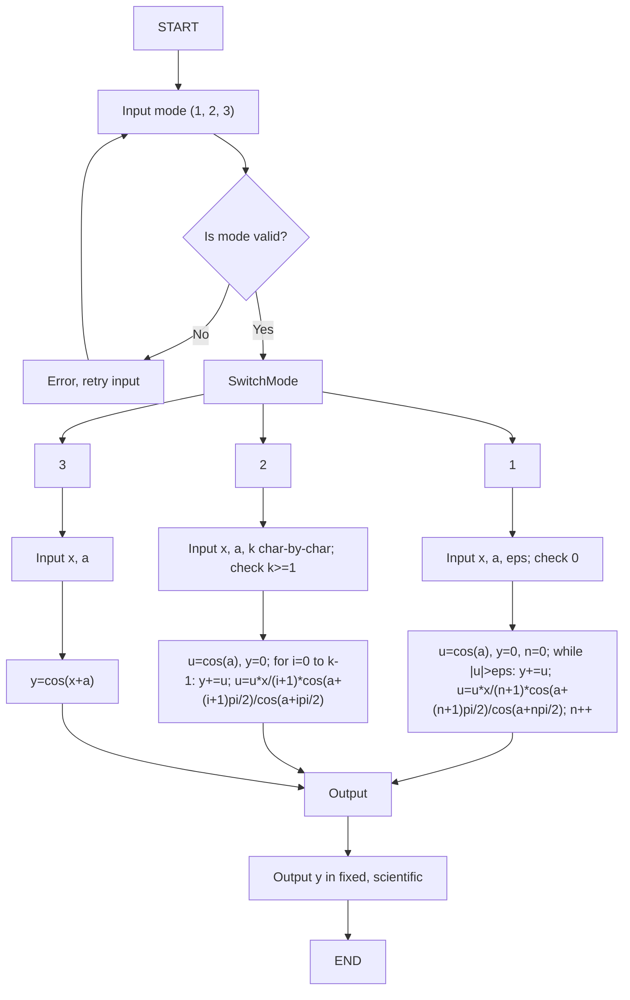

## 5. Проектирование тестов

| № | Назначение | Входные данные | Ожидаемый результат | Пояснение |
|---|------------|----------------|---------------------|-----------|
| 1 | Режим 1, базовый | mode=1, x=1, a=0, eps=0.001 | y≈0.540302 | Сумма ряда до $\epsilon$ |
| 2 | Режим 2, первые k | mode=2, x=1, a=0, k=3 | y≈0.541667 | Первые 3 члена |
| 3 | Режим 3, аналитически | mode=3, x=1, a=0 | y≈0.540302 | $\cos(1)$ из <cmath> |
| 4 | Некорректный eps | mode=1, x=1, a=0, eps=2 | Ошибка | Проверка $0 < \epsilon < 1$ |
| 5 | Некорректный k | mode=2, x=1, a=0, k=-1 | Ошибка | Проверка $k \geq 1$ |

## 6. Проверка правильности алгоритма

**Тест 1:** $a=0$, $u=\cos(0)=1$, $y=1$, $u \approx -0.5$, ... до $|u| \leq 0.001$

**Тест 2:** $y=1 - 0.5 + 0.041667 \approx 0.541667$

**Тест 3:** $y=\cos(1+0) \approx 0.540302$

## 7. Кодирование алгоритма

```cpp
#include <iostream>
#include <sstream>
#include <cmath>
#include <iomanip>
using namespace std;

int main() {
    setlocale(LC_ALL, "Russian");
    int mode;
    double x, a, eps, y;
    int k;
    string input;

    while (true) {
        cout << "Введите режим (1 - точность, 2 - k членов, 3 - аналитически): ";
        getline(cin, input);
        stringstream ss(input);
        if (ss >> mode && ss.eof() && mode >= 1 && mode <= 3) break;
        cout << "Ошибка: mode должен быть 1, 2 или 3" << endl;
    }

    switch (mode) {
        case 1:
            while (true) {
                cout << "Введите x: ";
                getline(cin, input);
                stringstream ss(input);
                if (ss >> x && ss.eof()) break;
                cout << "Ошибка: x должен быть числом" << endl;
            }
            while (true) {
                cout << "Введите a: ";
                getline(cin, input);
                stringstream ss(input);
                if (ss >> a && ss.eof()) break;
                cout << "Ошибка: a должен быть числом" << endl;
            }
            while (true) {
                cout << "Введите eps (0 < eps < 1): ";
                getline(cin, input);
                stringstream ss(input);
                if (ss >> eps && ss.eof() && eps > 0 && eps < 1) break;
                cout << "Ошибка: eps должен быть 0 < eps < 1" << endl;
            }
            {
                double u = cos(a);
                y = 0.0;
                int n = 0;
                while (fabs(u) > eps) {
                    y += u;
                    n++;
                    u = u * x / n * cos(a + n * M_PI / 2) / cos(a + (n-1) * M_PI / 2);
                }
            }
            cout << fixed << setprecision(6) << "Результат (fixed): " << y << endl;
            cout << scientific << setprecision(6) << "Результат (scientific): " << y << endl;
            break;

        case 2:
            while (true) {
                cout << "Введите x: ";
                getline(cin, input);
                stringstream ss(input);
                if (ss >> x && ss.eof()) break;
                cout << "Ошибка: x должен быть числом" << endl;
            }
            while (true) {
                cout << "Введите a: ";
                getline(cin, input);
                stringstream ss(input);
                if (ss >> a && ss.eof()) break;
                cout << "Ошибка: a должен быть числом" << endl;
            }
            while (true) {
                cout << "Введите k (>= 1): ";
                k = 0;
                char c;
                bool valid = true;
                while (cin.get(c) && c != '\n') {
                    if (c >= '0' && c <= '9') k = k * 10 + (c - '0');
                    else valid = false;
                }
                if (valid && k >= 1) break;
                cout << "Ошибка: k должен быть целым числом >= 1" << endl;
                cin.clear();
                cin.ignore(10000, '\n');
            }
            {
                double u = cos(a);
                y = 0.0;
                for (int i = 0; i < k; i++) {
                    y += u;
                    u = u * x / (i + 1) * cos(a + (i + 1) * M_PI / 2) / cos(a + i * M_PI / 2);
                }
            }
            cout << fixed << setprecision(6) << "Результат (fixed): " << y << endl;
            cout << scientific << setprecision(6) << "Результат (scientific): " << y << endl;
            break;

        case 3:
            while (true) {
                cout << "Введите x: ";
                getline(cin, input);
                stringstream ss(input);
                if (ss >> x && ss.eof()) break;
                cout << "Ошибка: x должен быть числом" << endl;
            }
            while (true) {
                cout << "Введите a: ";
                getline(cin, input);
                stringstream ss(input);
                if (ss >> a && ss.eof()) break;
                cout << "Ошибка: a должен быть числом" << endl;
            }
            y = cos(x + a);
            cout << fixed << setprecision(6) << "Результат (fixed): " << y << endl;
            cout << scientific << setprecision(6) << "Результат (scientific): " << y << endl;
            break;
    }
    return 0;
}
```

# Задача А: Вариант 7 — Вычисление $\ln x$

## 1. Условие задачи
Вычислить $\ln x$ для $0 < x \leq 2$:
$$\ln x = \sum_{n=1}^{\infty} (-1)^{n-1} \frac{(x-1)^n}{n} = (x-1) - \frac{(x-1)^2}{2} + \frac{(x-1)^3}{3} - \dots$$

**Применение:** Финансовые расчёты, анализ данных.

## 2. Математическая модель
- **С $\epsilon$:** $u_1 = x-1$, $u_{n+1} = -u_n \cdot \frac{x-1}{n+1}$
- **Первые $k$:** аналогично
- **Аналитически:** $y = \ln(x)$

## 3. Таблица внешних спецификаций

| Параметр | Тип     | Диапазон           | Описание              |
|----------|---------|--------------------|-----------------------|
| x        | double  | $0 < x \leq 2$     | Аргумент функции    |
| eps      | double  | $0 < \epsilon < 1$ | Точность             |
| k        | int     | $k \geq 1$         | Количество членов ряда |
| mode     | int     | 1, 2, 3            | Режим вычисления     |
| y        | double  | Любое вещественное | Значение $\ln x$     |

## 4. Алгоритмизация

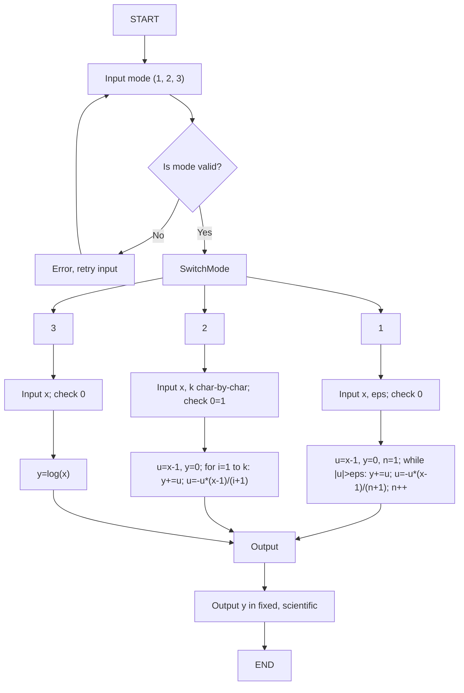

## 5. Проектирование тестов

| № | Назначение | Входные данные | Ожидаемый результат | Пояснение |
|---|------------|----------------|---------------------|-----------|
| 1 | Режим 1, базовый | mode=1, x=2, eps=0.001 | y≈0.693147 | Сумма ряда до $\epsilon$ |
| 2 | Режим 2, первые k | mode=2, x=2, k=3 | y≈0.833333 | Первые 3 члена |
| 3 | Режим 3, аналитически | mode=3, x=2 | y≈0.693147 | $\ln(2)$ из <cmath> |
| 4 | Некорректный x | mode=1, x=3, eps=0.001 | Ошибка | Проверка $0 < x \leq 2$ |
| 5 | Некорректный eps | mode=1, x=2, eps=2 | Ошибка | Проверка $0 < \epsilon < 1$ |

## 6. Проверка правильности алгоритма

**Тест 1:** $x=2$, $u=1$, $y=1$, $u=-0.5$, $y=0.5$, $u \approx 0.333333$, ... до $|u| \leq 0.001$

**Test 2:** $y=1 - 0.5 + 0.333333 \approx 0.833333$

**Test 3:** $y=\ln(2) \approx 0.693147$

## 7. Кодирование алгоритма

```cpp
#include <iostream>
#include <sstream>
#include <cmath>
#include <iomanip>
using namespace std;

int main() {
    setlocale(LC_ALL, "Russian");
    int mode;
    double x, eps, y;
    int k;
    string input;

    while (true) {
        cout << "Введите режим (1 - точность, 2 - k членов, 3 - аналитически): ";
        getline(cin, input);
        stringstream ss(input);
        if (ss >> mode && ss.eof() && mode >= 1 && mode <= 3) break;
        cout << "Ошибка: mode должен быть 1, 2 или 3" << endl;
    }

    switch (mode) {
        case 1:
            while (true) {
                cout << "Введите x (0 < x <= 2): ";
                getline(cin, input);
                stringstream ss(input);
                if (ss >> x && ss.eof() && x > 0 && x <= 2) break;
                cout << "Ошибка: x должен быть 0 < x <= 2" << endl;
            }
            while (true) {
                cout << "Введите eps (0 < eps < 1): ";
                getline(cin, input);
                stringstream ss(input);
                if (ss >> eps && ss.eof() && eps > 0 && eps < 1) break;
                cout << "Ошибка: eps должен быть 0 < eps < 1" << endl;
            }
            {
                double u = x - 1;
                y = 0.0;
                int n = 1;
                while (fabs(u) > eps) {
                    y += u;
                    n++;
                    u = -u * (x - 1) / n;
                }
            }
            cout << fixed << setprecision(6) << "Результат (fixed): " << y << endl;
            cout << scientific << setprecision(6) << "Результат (scientific): " << y << endl;
            break;

        case 2:
            while (true) {
                cout << "Введите x (0 < x <= 2): ";
                getline(cin, input);
                stringstream ss(input);
                if (ss >> x && ss.eof() && x > 0 && x <= 2) break;
                cout << "Ошибка: x должен быть 0 < x <= 2" << endl;
            }
            while (true) {
                cout << "Введите k (>= 1): ";
                k = 0;
                char c;
                bool valid = true;
                while (cin.get(c) && c != '\n') {
                    if (c >= '0' && c <= '9') k = k * 10 + (c - '0');
                    else valid = false;
                }
                if (valid && k >= 1) break;
                cout << "Ошибка: k должен быть целым числом >= 1" << endl;
                cin.clear();
                cin.ignore(10000, '\n');
            }
            {
                double u = x - 1;
                y = 0.0;
                for (int i = 1; i <= k; i++) {
                    y += u;
                    u = -u * (x - 1) / (i + 1);
                }
            }
            cout << fixed << setprecision(6) << "Результат (fixed): " << y << endl;
            cout << scientific << setprecision(6) << "Результат (scientific): " << y << endl;
            break;

        case 3:
            while (true) {
                cout << "Введите x (0 < x <= 2): ";
                getline(cin, input);
                stringstream ss(input);
                if (ss >> x && ss.eof() && x > 0 && x <= 2) break;
                cout << "Ошибка: x должен быть 0 < x <= 2" << endl;
            }
            y = log(x);
            cout << fixed << setprecision(6) << "Результат (fixed): " << y << endl;
            cout << scientific << setprecision(6) << "Результат (scientific): " << y << endl;
            break;
    }
    return 0;
}
```

