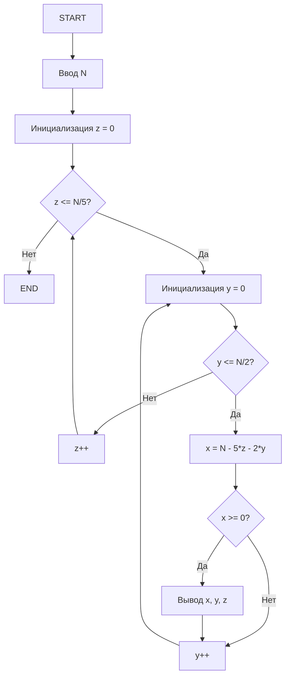
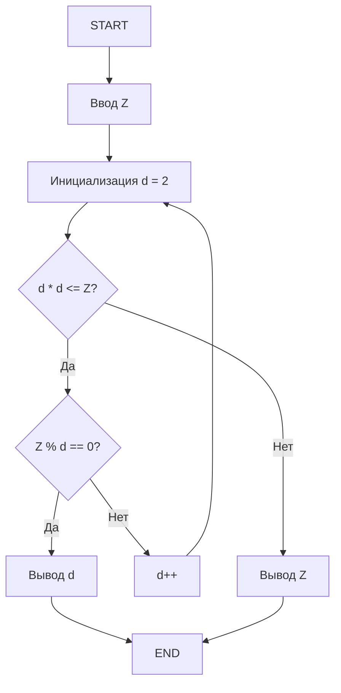
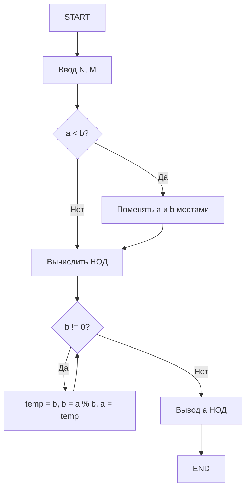
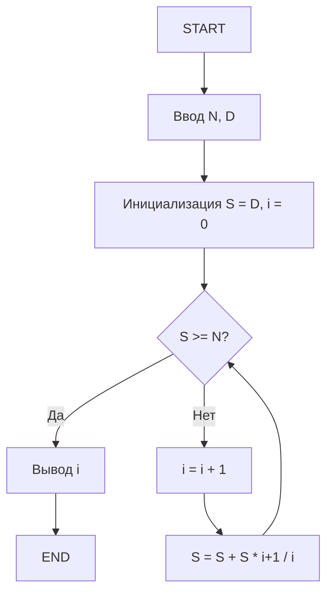
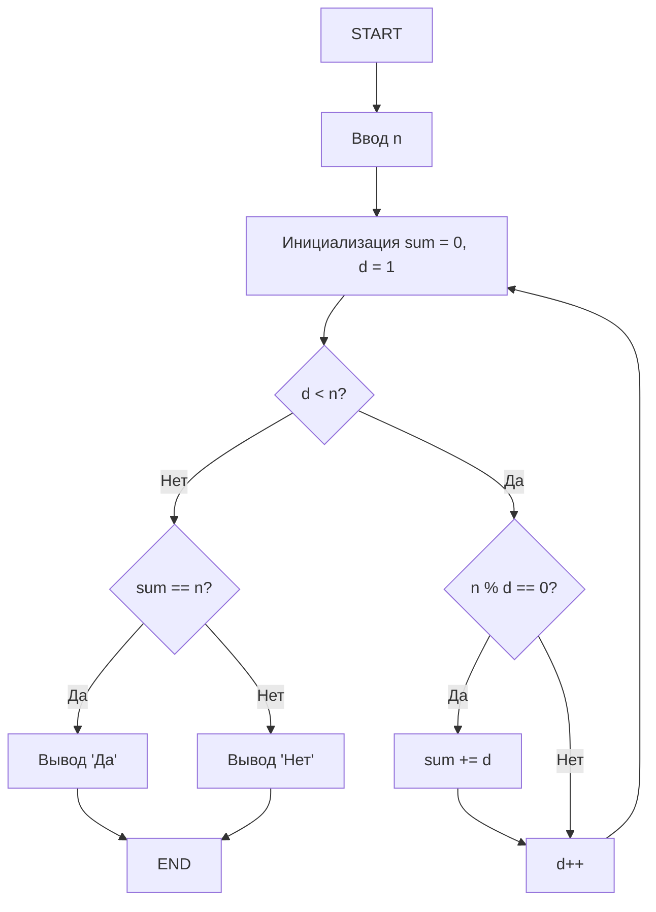
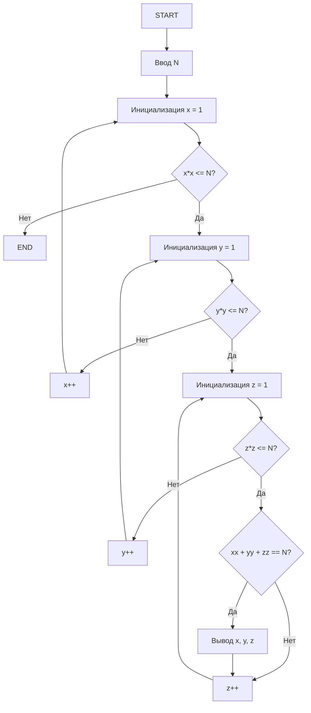
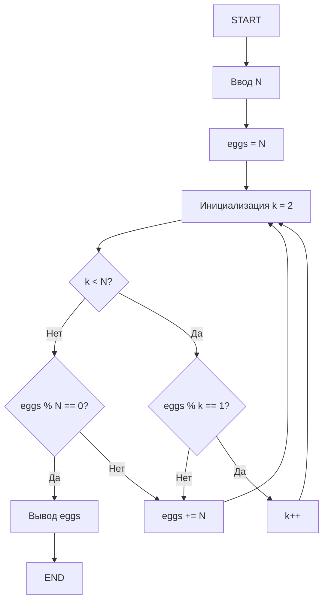
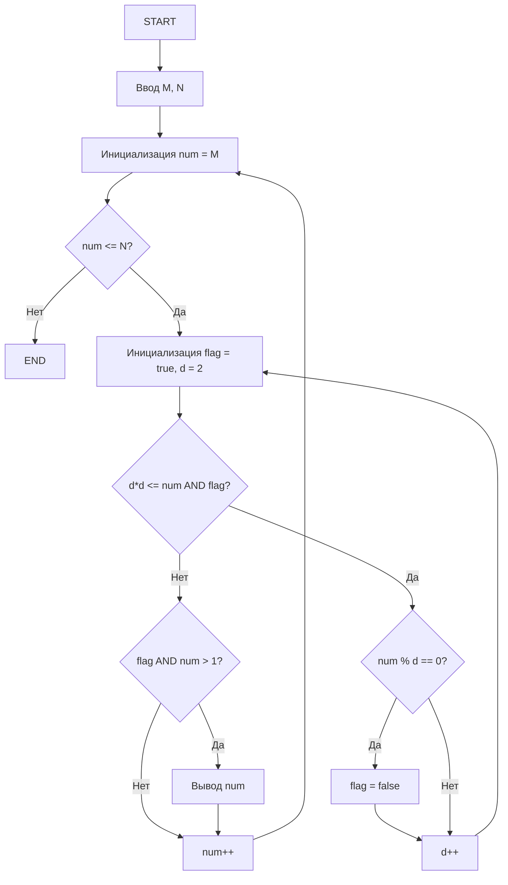

# Решение задач 151-158

## Задача 151: Способы выплаты суммы монетами 1, 2 и 5 рублей

**Условие:** Дано натуральное число `N`. Получить все способы выплаты суммы с помощью монет достоинством 1, 2 и 5 рублей.

### Таблица внешних спецификаций (ТВС)

| Имя | Тип | Назначение                   |
|-----|-----|-----------------------------|
| N   | int | сумма для размена           |
| x   | int | количество монет по 1 рублю |
| y   | int | количество монет по 2 рубля |
| z   | int | количество монет по 5 рублей|

### Блок-схема



### Код

```cpp
#include <iostream>
using namespace std;

int main() {
    int N;
    cout << "Введите сумму N: ";
    cin >> N;
    
    for (int z = 0; z <= N / 5; z++) {
        for (int y = 0; y <= N / 2; y++) {
            int x = N - 5 * z - 2 * y;
            if (x >= 0) {
                cout << "1*" << x << " + 2*" << y << " + 5*" << z << endl;
            }
        }
    }
    
    return 0;
}
```

---

## Задача 152: Наименьший делитель числа

**Условие:** Дано натуральное число `Z`. Найти его наименьший делитель (кроме 1).

### ТВС

| Имя | Тип | Назначение         |
|-----|-----|-------------------|
| Z   | int | входное число     |
| d   | int | найденный делитель|

### Блок-схема



### Код

```cpp
#include <iostream>
using namespace std;

int main() {
    int Z;
    cout << "Введите число Z: ";
    cin >> Z;
    
    for (int d = 2; d * d <= Z; d++) {
        if (Z % d == 0) {
            cout << "Наименьший делитель: " << d;
            return 0;
        }
    }
    
    cout << "Наименьший делитель: " << Z;
    return 0;
}
```

---

## Задача 153: Скорость туристов

**Условие:** Туристы проехали N и M км в два дня, скорость одинаковая и выражалась целым числом км/ч. Найти наибольшую возможную скорость.

### ТВС

| Имя | Тип | Назначение                     |
|-----|-----|-------------------------------|
| N   | int | путь 1-го дня                 |
| M   | int | путь 2-го дня                 |
| v   | int | наибольшая скорость (НОД(N,M))|

### Блок-схема



### Код

```cpp
#include <iostream>
using namespace std;

int gcd(int a, int b) {
    while (b != 0) {
        int temp = b;
        b = a % b;
        a = temp;
    }
    return a;
}

int main() {
    int N, M;
    cout << "Введите расстояния N и M: ";
    cin >> N >> M;
    
    cout << "Наибольшая возможная скорость: " << gcd(N, M);
    return 0;
}
```

---

## Задача 154: Помощники деда (Репка)

**Условие:** Надо развить усилие N кг. Дед тянет с силой D. Каждый i-й помощник тянет с усилием `S/(i/(i+1))`, где S – общее усилие предыдущих.

### ТВС

| Имя | Тип   | Назначение       |
|-----|-------|-----------------|
| N   | int   | требуемое усилие|
| D   | int   | усилие деда     |
| i   | int   | номер помощника |
| S   | float | общее усилие    |

### Блок-схема



### Код

```cpp
#include <iostream>
using namespace std;

int main() {
    int N, D;
    cout << "Введите требуемое усилие N и усилие деда D: ";
    cin >> N >> D;
    
    double S = D;
    int i = 0;
    
    while (S < N) {
        i++;
        S += S * (i + 1.0) / i;
    }
    
    cout << "Количество помощников: " << i;
    return 0;
}
```

---

## Задача 155: Совершенное число

**Условие:** Проверить, является ли число совершенным.

### ТВС

| Имя | Тип | Назначение        |
|-----|-----|------------------|
| n   | int | проверяемое число|
| sum | int | сумма делителей  |

### Блок-схема



### Код

```cpp
#include <iostream>
using namespace std;

int main() {
    int n;
    cout << "Введите число: ";
    cin >> n;
    
    int sum = 0;
    for (int d = 1; d < n; d++) {
        if (n % d == 0) {
            sum += d;
        }
    }
    
    if (sum == n) {
        cout << "Да";
    } else {
        cout << "Нет";
    }
    
    return 0;
}
```

---

## Задача 156: Представление числа как суммы трёх квадратов

**Условие:** Найти все тройки x,y,z такие, что `N = x^2 + y^2 + z^2`.

### ТВС

| Имя | Тип | Назначение          |
|-----|-----|--------------------|
| N   | int | заданное число     |
| x   | int | первое слагаемое   |
| y   | int | второе слагаемое   |
| z   | int | третье слагаемое   |

### Блок-схема



### Код

```cpp
#include <iostream>
using namespace std;

int main() {
    int N;
    cout << "Введите число N: ";
    cin >> N;
    
    for (int x = 1; x * x <= N; x++) {
        for (int y = 1; y * y <= N; y++) {
            for (int z = 1; z * z <= N; z++) {
                if (x * x + y * y + z * z == N) {
                    cout << x << "^2 + " << y << "^2 + " << z << "^2 = " << N << endl;
                }
            }
        }
    }
    
    return 0;
}
```

---

## Задача 157: Яйца крестьянки

**Условие:** При раскладке по 2,3,... остаток 1, а по N — без остатка. Найти минимальное число яиц.

### ТВС

| Имя  | Тип | Назначение                    |
|------|-----|------------------------------|
| N    | int | число для деления без остатка|
| eggs | int | количество яиц               |
| k    | int | делитель                     |

### Блок-схема



### Код

```cpp
#include <iostream>
using namespace std;

bool check(int eggs, int N) {
    for (int k = 2; k < N; k++) {
        if (eggs % k != 1) {
            return false;
        }
    }
    return eggs % N == 0;
}

int main() {
    int N;
    cout << "Введите N: ";
    cin >> N;
    
    int eggs = N;
    while (!check(eggs, N)) {
        eggs += N;
    }
    
    cout << "Минимальное количество яиц: " << eggs;
    return 0;
}
```

---

## Задача 158: Простые числа в интервале

**Условие:** Найти все простые числа в интервале от M до N.

### ТВС

| Имя | Тип | Назначение          |
|-----|-----|--------------------|
| M   | int | начало интервала   |
| N   | int | конец интервала    |
| num | int | текущее число      |
| d   | int | делитель           |
| flag| bool| флаг простоты числа|

### Блок-схема




### Код

```cpp
#include <iostream>
using namespace std;

bool isPrime(int num) {
    if (num <= 1) return false;
    for (int d = 2; d * d <= num; d++) {
        if (num % d == 0) {
            return false;
        }
    }
    return true;
}

int main() {
    int M, N;
    cout << "Введите интервал [M, N]: ";
    cin >> M >> N;
    
    for (int num = M; num <= N; num++) {
        if (isPrime(num)) {
            cout << num << " ";
        }
    }
    
    return 0;
}
```
